# LawSummBart

# ⚖️ Legal Document Summarization using Extract-Then-Assign (ETA) + LoRA Fine-Tuned BART

This project implements an efficient and domain-adapted **legal document summarization system** using:

- **Extract-Then-Assign (ETA)** dataset generation
- **BART-Large** for abstractive summarization
- **Parameter-Efficient Fine-Tuning (LoRA)**
- **ROUGE / BERTScore based similarity assignment**

The goal is to produce high-quality summaries for long Indian legal documents such as court judgments, which often exceed the input limits of standard transformer models.

---

## 🚀 Features

- Builds a **7× expanded training dataset** using Extract-Then-Assign
- Uses **seven extractive summarization techniques**
- Assigns each ground-truth summary sentence to the most relevant extractive chunk
- Fine-tunes BART-Large using **LoRA** (massive memory savings)
- Achieves high performance on legal summarization tasks
- Evaluates with ROUGE and BERTScore
- Fully reproducible training pipeline (Kaggle-friendly)

---

## 🧠 Project Architecture

### 🔄 End-to-End Pipeline

```mermaid
flowchart TD
    A[📄 Raw Legal Document] --> B[🛠️ Preprocessing]
    B --> C[📊 Extractive Summarization<br/>7 Methods]
    C --> D[TextRank]
    C --> E[LexRank]
    C --> F[LSA]
    C --> G[KL-Sum]
    C --> H[LUHN]
    C --> I[SumBasic]
    C --> J[SBERT]
    D & E & F & G & H & I & J --> K[🎯 Extract-Then-Assign<br/>ETA]
    K --> L[📈 Expanded Training Dataset<br/>7× Original Size]
    L --> M[🤖 LoRA Fine-Tuned<br/>BART-Large]
    M --> N[✅ Final Legal Summary]
```




---
### Project Flow Diagram


## 🧮 Training (BART + LoRA)

We fine-tune the BART-Large CNN model using LoRA to reduce memory usage.

### LoRA Configuration

```python
LoraConfig(
    r=16,
    lora_alpha=32,
    lora_dropout=0.1,
    target_modules=["q_proj", "v_proj"],
    task_type="SEQ_2_SEQ_LM"
)
```

### Training Arguments

```python
TrainingArguments(
    num_train_epochs=10,
    per_device_train_batch_size=4,
    gradient_accumulation_steps=2,
    learning_rate=1e-4,
    eval_strategy="epoch",
    save_strategy="epoch",
    fp16=True,
    load_best_model_at_end=True,
    metric_for_best_model="eval_loss"
)
```


### Why LoRA?

* Trains only 5–10M parameters instead of 406M
* Saves >60% GPU memory
* Faster fine-tuning on free GPUs (Kaggle, Colab)

---
### Training Loss Curve

*Training and validation loss progression across epochs showing model convergence*

## 📊 Evaluation Metrics

We evaluate using:

### **ROUGE**
* ROUGE-1
* ROUGE-2
* ROUGE-L

### **BERTScore**
* Precision
* Recall
* F1

---

## 🏆 Results

```
ROUGE-1: 0.5723
ROUGE-2: 0.3547
ROUGE-L: 0.3169

BERTScore Precision: 0.8453
BERTScore Recall: 0.8535
BERTScore F1: 0.8493
```

---

## 🧭 Future Work

* Use long-context models (Longformer, LED, BigBird)
* Improve cross-chunk coherence with hierarchical summarization
* Add multilingual support for Indian courts
* Include citation reasoning and legal argument extraction

---

## ⭐ Acknowledgements

* Rishiai Dataset
* FIRE Legal Track
* HuggingFace Transformers
* PEFT (LoRA)
* ROUGE & BERTScore libraries

---

## 🚀 Quick Start - Using the Pre-trained Model

You can use the deployed model directly from HuggingFace:

### Installation

```bash
pip install -U "transformers==4.53.3" "huggingface_hub>=0.18.0" "accelerate>=0.18.0" "safetensors"
```

### Usage Example

```python
import warnings
import torch
warnings.filterwarnings("ignore")

from transformers import AutoTokenizer, AutoModelForSeq2SeqLM

# Load the model and tokenizer
tokenizer = AutoTokenizer.from_pretrained("qwertyqwerty070806/LawSummBart", trust_remote_code=True)
model = AutoModelForSeq2SeqLM.from_pretrained("qwertyqwerty070806/LawSummBart", trust_remote_code=True)

# Move to GPU if available
try:
    model = model.to("cuda")
except AttributeError:
    print("CUDA not available, using CPU")

# Example legal text
text = """On March 5, 2021, the Securities and Exchange Commission charged AT&T, Inc. with repeatedly
violating Regulation FD, and three of its Investor Relations executives with aiding and abetting AT&T's 
violations, by selectively disclosing material nonpublic information to research analysts..."""

# Tokenize input
inputs = tokenizer(text, return_tensors="pt", truncation=True, max_length=512).to("cuda")

# Generate summary
with torch.no_grad():
    summary_ids = model.generate(
        **inputs,
        max_length=220,
        min_length=80,
        num_beams=5,
        length_penalty=1.0,
        no_repeat_ngram_size=3
    )

# Decode and print summary
summary = tokenizer.decode(summary_ids[0], skip_special_tokens=True)
print(summary)
```

### Model Parameters

| Parameter | Value | Description |
|-----------|-------|-------------|
| `max_length` | 220 | Maximum length of generated summary |
| `min_length` | 80 | Minimum length of generated summary |
| `num_beams` | 5 | Beam search width for better quality |
| `length_penalty` | 1.0 | Controls length preference |
| `no_repeat_ngram_size` | 3 | Prevents repetitive phrases |

### 🤗 Model Hub

Find the model on HuggingFace: [qwertyqwerty070806/LawSummBart](https://huggingface.co/qwertyqwerty070806/LawSummBart)

